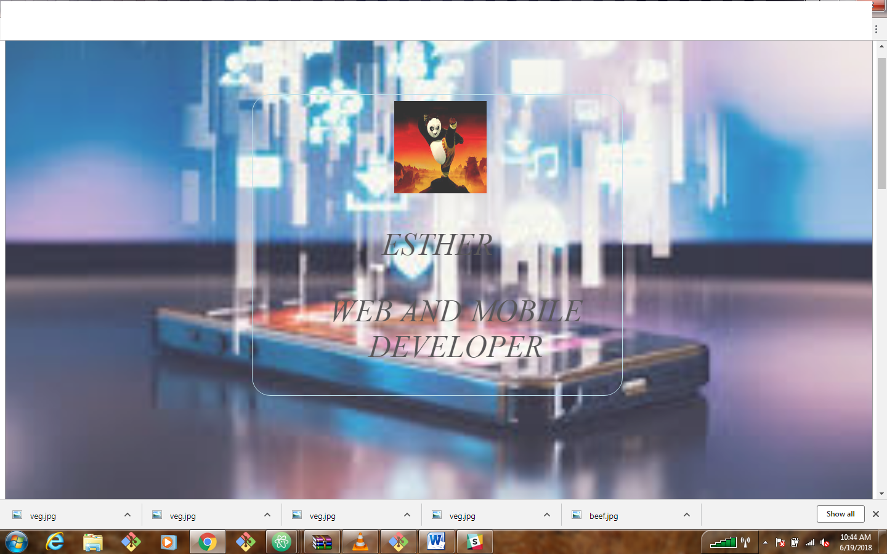

# Portfolio

## Landing SITE

## Website
This is a web portfolio to show case my work.

## Usage
* Fork the repository
* Create a new branch (--fix) in git on your computer
* Make changes to the work on the new branch
* Add the changes
* Commit changes
* Push the changes
* Create a pull request

## Setup/Installation Requirements
* Atom editor
* git bash
* Google chrome

## Known Bugs
* Properly merge the about branch to master to reflect the desired changes

## Technologies Used
* HTML
* CSS

## Support and contact details
For more information: Send a message on slack \@ Esther

### Demo
https://emukungu.github.io/portfolio/

### License
MIT License

Copyright (c) [year] [fullname]

Permission is hereby granted, free of charge, to any person obtaining a copy
of this software and associated documentation files (the "Software"), to deal
in the Software without restriction, including without limitation the rights
to use, copy, modify, merge, publish, distribute, sublicense, and/or sell
copies of the Software, and to permit persons to whom the Software is
furnished to do so, subject to the following conditions:

The above copyright notice and this permission notice shall be included in all
copies or substantial portions of the Software.

THE SOFTWARE IS PROVIDED "AS IS", WITHOUT WARRANTY OF ANY KIND, EXPRESS OR
IMPLIED, INCLUDING BUT NOT LIMITED TO THE WARRANTIES OF MERCHANTABILITY,
FITNESS FOR A PARTICULAR PURPOSE AND NONINFRINGEMENT. IN NO EVENT SHALL THE
AUTHORS OR COPYRIGHT HOLDERS BE LIABLE FOR ANY CLAIM, DAMAGES OR OTHER
LIABILITY, WHETHER IN AN ACTION OF CONTRACT, TORT OR OTHERWISE, ARISING FROM,
OUT OF OR IN CONNECTION WITH THE SOFTWARE OR THE USE OR OTHER DEALINGS IN THE
SOFTWARE.
*{Determine the license under which this application can be used.  See below for more details on licensing.}*
Copyright (c) {2018} **{Esther}**
